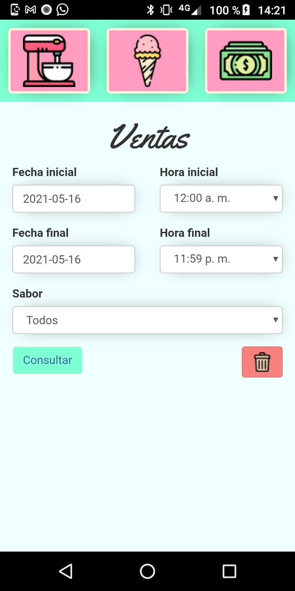

# Heladitos
This Android app bears a simple but useful inventory system that uses webview's localstorage for storing its data. It was designed for a small business that buys/sells heladitos (ice creamies).
 
<h4>This app allows you to:</h4>
<ul>
<li>Create flavors.</li>
<li>Manage sell and cost values for every flavor.</li>
<li>Add/remove stock.</li>
<li>Get reports about sells, costs, yields, losses, most/least sold flavors.</li>
</ul>

 
<h4>Some screeshots</h4>

 

 

 

